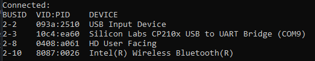

# IOT Project

This project hasn't completed yet
TODO:
- Communicate between server and esp32
- RFID card reading

## Install
Follow detailed instructions provided specifically for this example.

Select the instructions depending on Espressif chip installed on your development board:

- [ESP32 Getting Started Guide](https://docs.espressif.com/projects/esp-idf/en/stable/get-started/index.html)
- [ESP32-S2 Getting Started Guide](https://docs.espressif.com/projects/esp-idf/en/latest/esp32s2/get-started/index.html)


## Flashing code
__This set up is just for WSL only__
* For the wsl sees the port, open PowerShell with administrator privillege and use ```"C:\Program Files\usbipd-win\usbipd.exe" list`` 
* Then ```usbipd.exe attach --wsl --busid BUSID``` to attach to wsl device file

* The wsl monitor the connecting device via /dev part. Using 
```ls /dev/ttyUSB* /dev/ttyACM* /dev/ttyS* 2>/dev/null``` to list all of them and ```/dev/ttyUSB0``` will be appeared if esp32 is wired successfully

__For Windows only user__

## Installation for Windows

### Step 1: Download ESP-IDF Tools Installer
1. Download the ESP-IDF Tools installer from: https://dl.espressif.com/dl/esp-idf/
2. Run the installer (esp-idf-tools-setup-x.x.x.exe)
3. Follow the installation wizard:
   - Choose "Express" installation for default setup
   - Select installation directory (default: C:\Espressif)
   - Let it download and install all required tools

### Step 2: Verify Installation
1. Open "ESP-IDF Command Prompt" from Start Menu
2. Run: `idf.py --version`
3. You should see the ESP-IDF version displayed

## Build and Monitor

### Configure Project
```bash
idf.py menuconfig
```
Navigate to:
- Component config -> WiFi -> Set your WiFi SSID and Password
- Component config -> MQTT -> Set your MQTT broker URL

Save with 'S' and exit with 'Q'

### Build the Project
```bash
idf.py build
```

### Flash to ESP32

For WSL:
```bash
idf.py -p /dev/ttyUSB0 flash
```

For Windows:
```bash
idf.py -p COM3 flash
```
(Replace COM3 with your actual port - check Device Manager under Ports)

### Monitor Serial Output

For WSL:
```bash
idf.py -p /dev/ttyUSB0 monitor
```

For Windows:
```bash
idf.py -p COM3 monitor
```

To exit monitor: Press `Ctrl+]`

### Build, Flash and Monitor (All at once)

For WSL:
```bash
idf.py -p /dev/ttyUSB0 flash monitor
```

For Windows:
```bash
idf.py -p COM3 flash monitor
```

## Send test data to broker
- Start mosquitto: `& "C:\Program Files\mosquitto\mosquitto.exe" -c C:\mosquitto.conf -v`